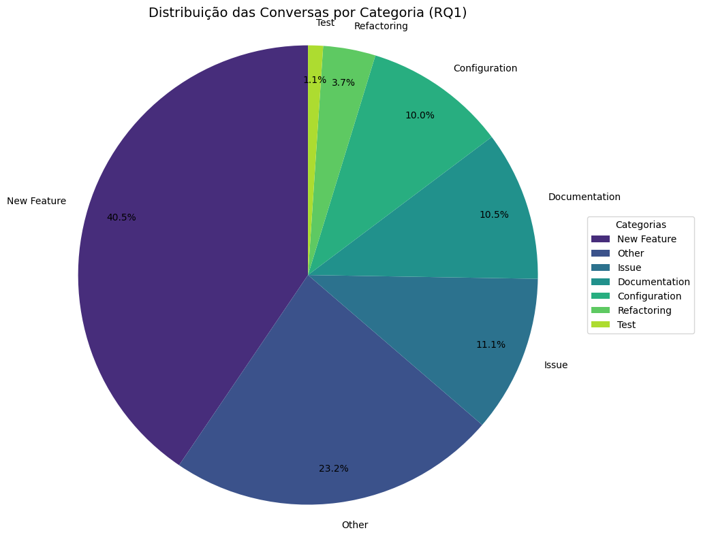
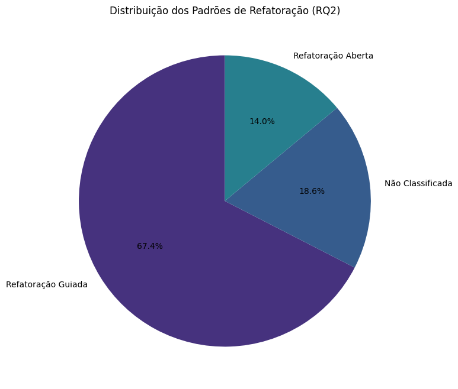

# Replicação — Analyzing Developer-ChatGPT Conversations for Software Refactoring (DevGPT)
        


## 👥 Integrantes do Projeto

Esta seção apresenta os integrantes envolvidos na replicação do estudo, bem como suas respectivas matrículas e responsabilidades no projeto.

| Nome do Integrante                    | Matrícula  | Função no Projeto                                                                                        |
| ------------------------------------- | ---------- | -------------------------------------------------------------------------------------------------------- |
| **NATALIA VANESSA LOPES MACEDO**      | 2023006804 | Coordenação geral do projeto, organização das atividades e acompanhamento das entregas                   |
| **GUSTAVO NEVES DA PAZ RAFAEL**       | 2023006831 | Líder técnico, responsável pela arquitetura da replicação, decisões metodológicas e integração do código |
| **PEDRO AIKAU LOUREIRO LIMA**         | 2023006958 | Replicação (1): mineração dos dados, pré-processamento, análise estatística e implementação das RQs      |
| **WALLACE LUAN DA CRUZ GUIMARÃES**    | 2023007310 | Replicação (2): apoio na implementação das RQs e validação dos resultados obtidos                        |
| **GABRIEL JUNICHIRO SOARES INADA**    | 2023006662 | Replicação (3): apoio na análise dos dados e verificação metodológica                                    |
| **YASMIM DOS SANTOS BARROS**          | 2022026704 | Replicação (4): apoio na classificação manual e validação das conversas                                  |
| **GABRIEL HENRIQUE LEMOS DE ATHAYDE** | 2023007187 | Relatório (1): redação técnica, estruturação dos resultados e normalização acadêmica                     |
| **RAUL DE LIMA LAVAREDA**             | 2023006967 | Relatório (2): revisão textual, análise crítica dos resultados e discussão                               |
| **IURI OLIVEIRA MATOS DA SILVA**      | 2023007211 | Relatório (3): consolidação do relatório final e revisão geral                                           |
| **ARAILSON DE PAIVA JUNIOR**          | 2023007122 | Responsável pelo seminário e apresentação dos resultados do projeto                                      |

---


## 1) Contextualização

Este repositório documenta a replicação (parcial) do estudo **“Analyzing Developer-ChatGPT Conversations for Software Refactoring: An Exploratory Study”**, utilizando o dataset público **DevGPT**. O objetivo principal é reproduzir, com rastreabilidade e transparência metodológica, as análises relacionadas às **três Questões de Pesquisa (RQs)** do artigo, a partir de um processo completo de:

* obtenção do dataset DevGPT,
* mineração/ingestão dos arquivos JSON por snapshot,
* preparação e limpeza da base minerada,
* execução das análises para RQ1, RQ2 e RQ3,
* comparação qualitativa e quantitativa (quando aplicável) com o artigo original.

> Observação: o artigo original trabalha com o dataset completo; nesta replicação, utilizamos um recorte por snapshot conforme estratégia experimental do projeto.

---

## 2) Descrição das RQs com base no artigo (Referências)

As questões de pesquisa são definidas pelo artigo base, e operacionalizadas aqui a partir da estrutura do DevGPT:

* **RQ1 — Natureza das conversas**
  Investiga **quais tipos de tópicos** predominam nas conversas entre desenvolvedores e o ChatGPT (ex.: documentação, issues/bugs, novas features, configuração, testes, refatoração).

* **RQ2 — Conversas sobre refatoração**
  Identifica **quais conversas são efetivamente sobre refatoração** e caracteriza **como a refatoração acontece**, incluindo a distinção conceitual entre:

  * **Refatoração Guiada** (instruções específicas do desenvolvedor)
  * **Refatoração Aberta** (pedido genérico de melhoria, decisões delegadas ao modelo)

* **RQ3 — Esforço conversacional (número de prompts)**
  Analisa **quantos prompts**, em média, são necessários para concluir uma conversa, estratificando por origem (commit, pull request, issue, discussion e hn).

**Referências:**

* Artigo base: *Analyzing Developer-ChatGPT Conversations for Software Refactoring: An Exploratory Study* (MSR/ICSE Workshop, conforme disponibilizado)
* Dataset: **DevGPT** — [https://github.com/NAIST-SE/DevGPT](https://github.com/NAIST-SE/DevGPT)

---

## 3) Etapas do Projeto

O fluxo do projeto foi organizado em etapas rastreáveis:

1. **Aquisição do dataset DevGPT**
2. **Mineração/ingestão dos arquivos JSON**
3. **Construção do dataset tabular (.csv)**
4. **Pré-processamento e criação do dataset final**
5. **Replicação das análises (RQ1, RQ2, RQ3)**
6. **Consolidação dos resultados e discussão**
7. **Conclusões e vieses**

---

## 4) Base de Dados

### 4.1 Fonte

A base de dados utilizada é o repositório **DevGPT**, que disponibiliza conversas Developer–ChatGPT associadas a diferentes origens:

* `commit`
* `pr`
* `issue`
* `discussion`
* `hn` (Hacker News)

Além disso, o DevGPT organiza os dados por **snapshots**, em diretórios no formato:

```
snapshot_YYYYMMDD
```

### 4.2 Estratégia de recorte

Para esta replicação, foi selecionado o snapshot:

* **Snapshot alvo:** `20230914`

> Motivação: permitir uma replicação controlada em um subconjunto temporal do DevGPT, mantendo consistência de pré-processamento e garantindo rastreabilidade dos resultados.

---

## 5) Mineração de Dados

### 5.1 Aquisição e Git LFS

Devido ao grande volume de dados, foi necessário utilizar **Git LFS** para baixar corretamente arquivos grandes do repositório:

```bash
git lfs install
git lfs pull
```

### 5.2 Ingestão dos JSONs

Foi implementado um script Python de mineração para:

* percorrer diretórios `snapshot_*`,
* filtrar arquivos `*.json` relevantes (`commit/pr/issue/discussion/hn`),
* localizar registros contendo `ChatgptSharing`,
* extrair turnos `Prompt/Answer`,
* normalizar os dados em formato tabular.

**Saída da mineração:** arquivo `.csv` consolidado contendo turnos (prompt/answer) por conversa.

---

## 6) Replicação do Projeto

Nesta etapa, o dataset minerado é carregado e processado para gerar o **dataset final** usado nas análises das RQs.

### 6.1 Carregamento do dataset minerado

* Leitura do CSV minerado
* Checagem de duplicatas (controle de ruído)
* Remoção de valores ausentes (quando aplicável)

Operações executadas no dataset:

* `df_dev.duplicated().sum()`
* `df_dev.dropna(inplace=True)`
* filtro do snapshot alvo:

  * `df_dev_updated = df_dev[df_dev["snapshot"] == 20230914]`

### 6.2 Dataset final

O dataset final contém:

* colunas de rastreabilidade (`snapshot`, `origem`, `chat_url`, `repo_url`)
* conteúdo (`prompt_text`, `answer_text`)
* ordem conversacional (`n_prompt`)
* tamanho de conversa (`total_prompts_conversa`)

---

## 6.1) Resultados do Collab — RQ1

### 6.1.1 Metodologia

* Unidade de análise: **conversa** (`chat_url`)
* Construção: agregação (`all_prompts`) via `groupby(chat_url)`
* Classificação temática por **categoria dominante** (score por palavras-chave)

### 6.1.2 Resultados




* **Distribuição temática (replicação):**

  * New Feature: `40.5%`
  * Other: `23.2%`
  * Issue: `11.1%`
  * Documentation: `10.5%`
  * Configuration: `10.0%`
  * Refactoring: `3.7%`
  * Test: `1.1%`

### 6.1.3 Comparação com o artigo


> Inserir comparação (quando houver percentuais reportados no paper).

---

## 6.2) Resultados do Collab — RQ2

A RQ2 foi conduzida em **três fases**:

### 6.2.1 Fase 01 — Mapping (detecção automática)

* Unidade: conversa (`chat_url`)
* Critério forte (v2):

  * contém “refactor” **OU**
  * possui **≥ 3** indicadores estruturais + presença de sinal estrutural

**Resultado (snapshot 20230914):**

* Total de conversas: **190**
* Candidatas à refatoração (critério forte v2): **51**
* Percentual: **26.84%**

### 6.2.2 Fase 02 — Verificação manual (remoção de falsos positivos)

As conversas candidatas foram revisadas manualmente na coluna:

* `manual_review ∈ {True, False}`

**Resultado:**

* Refatorações confirmadas: **47** (manual_review == True)
* Falsos positivos removidos: **4**

### 6.2.3 Fase 03 — Classificação (Guiada vs Aberta)

A classificação foi aplicada **somente nas conversas confirmadas**:

* **Guiada:** instruções específicas (rename, extract, split, apply pattern, etc.)
* **Aberta:** pedido genérico (refactor, clean up, improve readability, etc.)

**Resultado:**



> Inserir distribuição final:

* Refatoração Guiada: `67.4%`
* Refatoração Aberta: `14.0%`
* Não Classificada: `18.6%`

---

## 6.3) Resultados do Collab — RQ3

### 6.3.1 Metodologia

* Unidade de análise: conversa (`chat_url`)
* Métrica: **número de prompts por conversa**
* Estratégia: contar prompts por conversa e calcular a média por origem

> Observação: **não** é usado `drop_duplicates(subset="chat_url")`, pois isso elimina prompts legítimos da mesma conversa e invalida a métrica.

### 6.3.2 Resultados (Replicação)

Média de prompts por origem:

|     origem | media_prompts |
| ---------: | ------------: |
|         pr |          2.00 |
|     commit |          2.54 |
| discussion |          3.00 |
|      issue |          3.16 |
|         hn |          5.04 |

### 6.3.3 Comparação com o artigo (resumo)

* Commits: ~2.79 (menor média)
* PRs: ~4.64 (maior média)
* Discussions: ~3.64
* Issues: ~4.01
* Hacker News: ~4.06

> Diferenças são esperadas devido ao recorte por snapshot e ao tamanho reduzido da amostra na replicação.

---

## 7) Conclusão da Replicação

A replicação demonstrou que:

* A mineração do DevGPT é viável e reprodutível via ingestão robusta dos JSONs por snapshot.
* A RQ2 exige **validação manual** para remover falsos positivos, mesmo com critérios fortes.
* A distribuição temática (RQ1) e as médias por origem (RQ3) variam conforme o recorte temporal, mas preservam padrões plausíveis alinhados ao comportamento observado no estudo original.

---

## 8) Vieses e Limitações

* **Recorte por snapshot:** reduz o tamanho da amostra e altera a distribuição em relação ao dataset completo.
* **Heurísticas por palavras-chave:** podem gerar falsos negativos/positivos (especialmente em RQ1 e na Fase 03 da RQ2).
* **Classificação manual:** sujeita a viés do anotador (mitigável com dupla anotação e cálculo de concordância).
* **Granularidade conversacional:** conversas longas podem conter múltiplas intenções (ex.: bugfix + refatoração), dificultando rotulagem única.

---

Perfeito — abaixo está a **seção “Como Executar”**, escrita em **Markdown técnico**, clara, reprodutível e **alinhada a um README acadêmico no GitHub**, cobrindo:

* Clonagem do repositório
* Uso do **Git LFS**
* Execução do script Python de mineração
* Execução das análises no **Google Colab**

---

## ▶️ Como Executar o Projeto

Esta seção descreve, passo a passo, como reproduzir o processo de mineração, pré-processamento e análise dos dados utilizados na replicação do estudo, a partir do repositório oficial.

---

### 1️⃣ Clonagem do Repositório

Primeiramente, clone o repositório do projeto para sua máquina local:

```bash
git clone https://github.com/NAIST-SE/DevGPT
git clone https://github.com/GustavoNeves19/DevGPT-UFRA
cd SEU-REPOSITORIO
```


---

### 2️⃣ Configuração do Git LFS (Arquivos Grandes)

O dataset DevGPT contém arquivos de grande volume, armazenados via **Git Large File Storage (LFS)**.
Certifique-se de que o Git LFS está instalado:

```bash
git lfs install
```

Em seguida, faça o download completo dos arquivos versionados via LFS:

```bash
git lfs pull
```

Isso garantirá que todos os arquivos `.json` dos snapshots estejam disponíveis localmente.

---

### 3️⃣ Estrutura Esperada do Projeto

Após a clonagem, o repositório deve conter uma estrutura semelhante a:

```text
DevGPT-main/
│
├── snapshot_20230803/
├── snapshot_20230914/
├── mineracao.py
├── base_minerada_msr25.csv
├── Dev-ChatGpt.ipynb
└── README.md
```

Os diretórios `snapshot_YYYYMMDD` contêm os arquivos JSON originais do dataset DevGPT.

---

### 4️⃣ Execução da Mineração dos Dados (Python)

A mineração dos dados é realizada por meio do script Python `mineracao.py`, responsável por:

* Percorrer os snapshots do DevGPT
* Extrair conversas ChatGPT (Prompt/Answer)
* Normalizar os dados
* Gerar o dataset consolidado em CSV

Execute o script com:

```bash
python mineracao.py
```

Ao final da execução, será gerado o arquivo:

```text
base_minerada_msr24.csv
```

Este arquivo contém todas as interações mineradas e normalizadas, servindo como base para as análises das RQs.

---

### 5️⃣ Execução das Análises no Google Colab

As análises referentes às **RQ1, RQ2 e RQ3** são realizadas no notebook Jupyter/Colab:

```text
Dev-ChatGpt.ipynb
```

#### Passos recomendados:

1. Acesse o Google Colab:
   👉 [https://colab.research.google.com](https://colab.research.google.com)

2. Faça upload do notebook `Dev-ChatGpt.ipynb`

3. Faça upload do arquivo:

   ```text
   base_minerada_msr24.csv
   ```

4. Execute as células sequencialmente, seguindo a ordem:

   * Carregamento do dataset
   * Limpeza e filtragem por snapshot
   * Execução das RQs
   * Geração dos resultados e gráficos

> ✅ Todas as dependências utilizadas (pandas, numpy, matplotlib, seaborn, re) já estão disponíveis no ambiente padrão do Colab.

---

### 6️⃣ Observações Importantes

* A **classificação manual da RQ2 (Fase 02)** deve ser realizada diretamente no notebook, conforme descrito na metodologia.
* Resultados podem variar levemente conforme o snapshot selecionado.
* Para garantir fidelidade máxima ao artigo original, recomenda-se utilizar o snapshot **20230914**.


